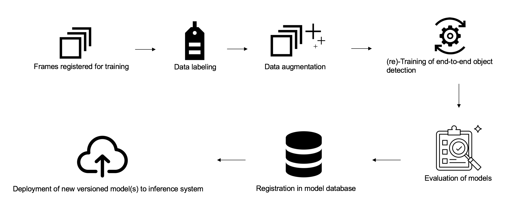

.. Yolo Pipeline documentation master file, created by
   sphinx-quickstart on Tue Jul 18 14:30:04 2017.
   You can adapt this file completely to your liking, but it should at least
   contain the root `toctree` directive.

Welcome to Yolo Pipeline's documentation!
=========================================

The purpose of this pipeline is to ease and automate the data augmentation, the framework configuration, the trainings, and evaluations of object detection models. It is made generic enough to be used with different object detection framework, and initiated with dynamic parameters located in one place - the configuration class.

.. include:: structure.rst

.. include:: model_description.rst

Training pipeline
+++++++++++++++++

The first step is of course to train our model. A high-level description of what I am doing can be seen in the next figure.

Frames registration and labeling
////////////////////////////////

A comprehensive dataset for the Helmet-detection use case has yet to be collected and annotated. 
For preliminary exploration, datasets such as Pascal Voc can be used(available `here <https://pjreddie.com/projects/pascal-voc-dataset-mirror/>`_  ). In order to label our own images with our own classes of objects, weused the open source tool `labelImg <https://github.com/tzutalin/labelImg>`_ . The bounding boxes are drawn around the objects of interest and labelled with semantic statements. e.g.: ”worker wearing/not wearing a helmet”

Within data/, images are then organized in folders corresponding to separate datasets. 

.. include:: augmentation.rst

Training
////////

Training is performed using back propagation, in batches. A few parameters to keep in mind when configuring for training :

* "batch_size": self-explanatory

* "learning rate": self-explanatory

* "subdivisions": Divides the batches by subdivision to reduce memory usage but only updates the weight after the whole batch has been processed

The parameters of the model are then saved to disk.

.. toctree::
   :maxdepth: 2
   
   installation
   configuration
   model_management
   evaluation
   optimization
   performance

Source files

.. toctree::
   :maxdepth: 1

   implementation

Inference system
++++++++++++++++

The system described below allows is a full design of our projected solution for Object detection. Frames will first be created from a video stream and those frames will be sent to our end-to-end detection model which will then send its predictions to a prediction interpreter, doing the job of deciding whether or not to raise an alarm.

.. figure::   images/inference_system.png

