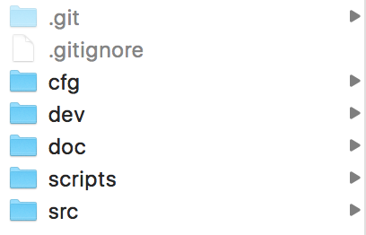

Structure
---------

The project folder contains several folders and files

*	“src” and “dev” are folders containing the source code for the pipeline and experimental code

*	“data” contains folders that correspond to individual datasets and “.names” files containing lists of classes names

*	“cfg” contains some network definitions

*	“weights” contains weights that are supposed to be reused and “backup” contains checkpoints for training
